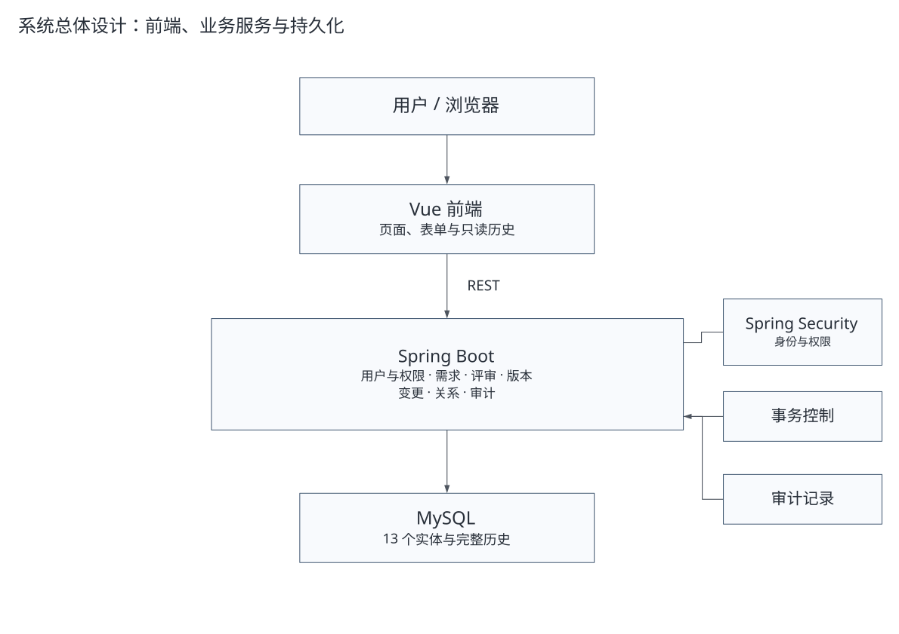
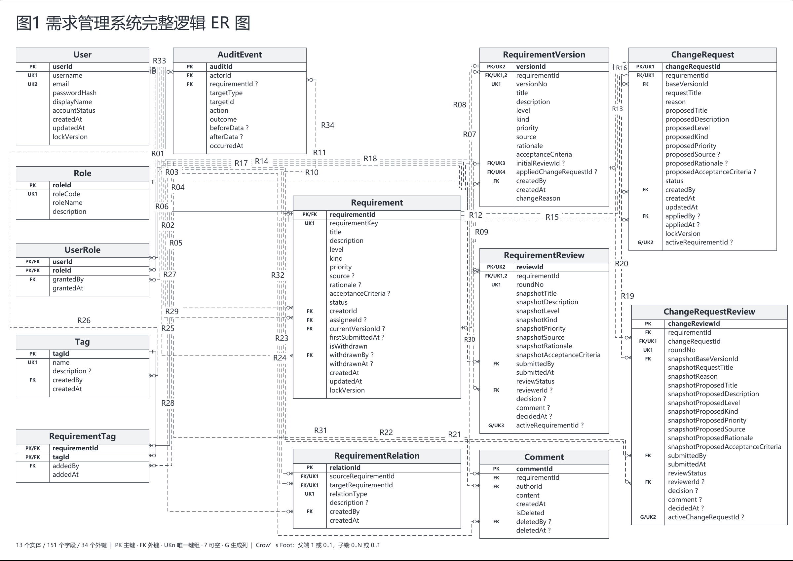

# XJTU RMS Coursework

这是西安交通大学“软件系统分析与设计”作业 2：分析并实现一个需求管理系统，再使用多智能体辅助完成实现、独立检查和受约束改进。报告从题目提出的问题展开；本仓库提供实现和便于复核的补充材料。

**先读 [课程报告](report/RMS_软件系统分析与设计作业2.pdf)，运行看 [RUN.md](RUN.md)，模型看 [完整 ER](docs/design/complete-er.pdf)。**

## 作业回答了什么

- 怎样从需求生命周期推导实体、属性和关系。
- 怎样区分当前内容、不可变正式版本和评审提交快照。
- 怎样控制批准后变更，并在一个事务中形成新版本。
- 怎样让实现与独立检查使用共同业务预期。
- 第一版四个问题怎样转成四条约束，再用相同场景比较第二版。

系统采用单项目范围，管理需求本身；项目排期、迭代任务、代码仓库和完整测试管理不在模型内。原业务为 64 条功能需求、97 条规则、13 个实体、151 个字段和 34 个外键。

## System

Vue 3 前端、Spring Boot 模块化单体、MySQL。版本、评审和变更应用跨模块协作，但关键写入仍使用同一数据库事务。



- [后端源码](backend/src/)
- [前端源码](frontend/src/)
- [OpenAPI](docs/design/openapi.yaml)
- [需求与用例](docs/requirements/requirements-summary.md)

## ER Model

一张 A3 横向总图包含全部 13 实体、151 字段和 34 外键。PK、FK、UK 组和可空性直接列在表框内；原生 Visio 中实体、字段和连接线可以编辑。



[矢量 PDF](docs/design/complete-er.pdf) · [可编辑 Visio](docs/design/RMS_Presentation_Models.vsdx) · [字段与外键说明](docs/design/README.md)

## Main Workflow

需求草稿 → 提交评审 → 正式批准版本 → 变更请求 → 变更评审 → 显式应用 → 新正式版本。

批准变更不自动应用；新版本回到已批准，随后重新确认实现和验证。退回重提保留各轮快照，历史正式版本只读。

## Multi-Agent Experiment

两版实际执行相同 32 个原代表场景：**V1 31 / 32 通过，V2 32 / 32 通过**。应用版本与需求正式版本分开计量。

四个问题是登录别名身份判断、客户端协议异常分类、分页标签 N+1 查询，以及重复失败观察模板与关键事务可读性。它们分别形成四条修改约束；没有改变原业务模型和状态机。

- [两版比较](docs/experiment/v1-v2-comparison.md)
- [问题、根因与约束](docs/experiment/findings-and-constraints.md)
- [32 个场景及未运行范围](docs/experiment/test-summary.md)
- [协作过程](docs/design/multi-agent-workflow.pdf)

## Run

需要 JDK 21、MySQL 8 和 `frontend/package.json` 指定的 Node/npm。配置自己的数据库与首次管理员凭据以后：

```sh
cd backend
./mvnw clean package -DskipTests
java -jar target/rms-backend-0.0.1-V1.jar
```

另一个终端：

```sh
cd frontend
npm ci
npm run dev
```

Vite 将 `/api` 代理到本地后端 18080。环境变量、首次初始化、HTTP 本地会话设置、Windows 命令和测试方法见 [RUN.md](RUN.md)。源码中的历史 Maven 名称仍含 V1；这里公开的是约束改进后的 V2 代码，名称不代表比较结果被更改。

## Report

- [唯一课程提交 PDF](report/RMS_软件系统分析与设计作业2.pdf)
- [UTF-8 TeX 源文件](report/RMS_软件系统分析与设计作业2.tex)
- [pdfLaTeX 编译说明](report/BUILD.md)

## Limitations

- 原设计 103 项中有 **71 项 NOT_RUN**，部分已选场景的变体也未覆盖。
- 两个身份共享同一登录别名，且同一密码同时匹配两个账号时，系统仍拒绝为 401。
- SQL 查询次数降低不等于已测得生产时延或吞吐提升。
- 未通过生产安全、负载或长期可用性认证（not production-certified）。
- 页面截图来自独立展示数据，不能当作历史 V1/V2 实验通过证据。
- 本仓库只发布必要源码和可阅读摘要，不发布原始凭据、数据库、内部运行日志或私人历史。
